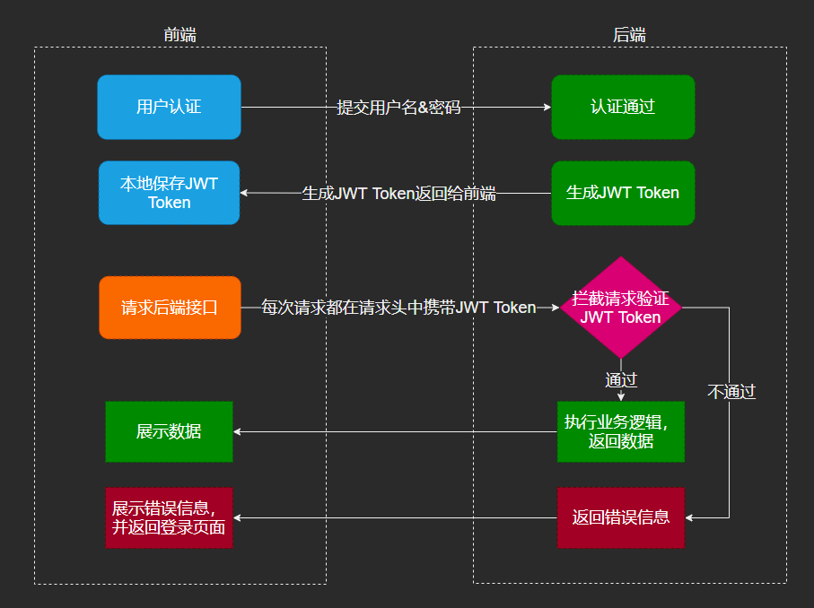
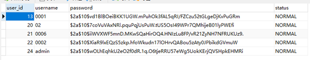
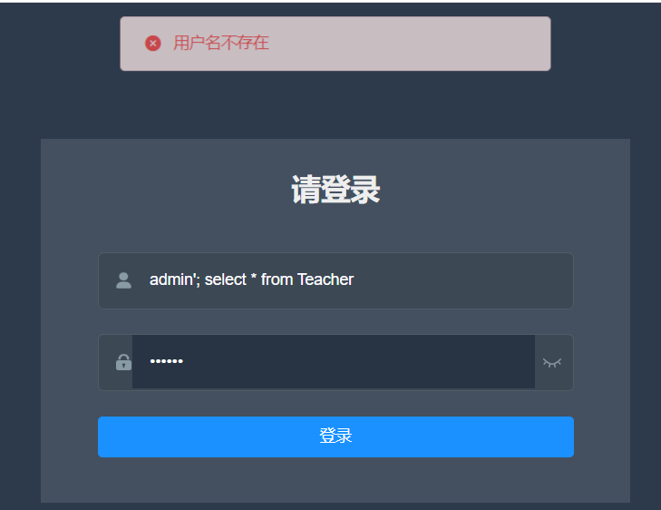

# Integrated Academic Management Information System

## Overview

   

## Features

开发此教务管理系统软件，使教务人员及操作者进行教务管理，方便操作者随时添加、查询、修改，使工作人员从繁琐的填表，查表工作中解放出来；使供需双方都获得满意的结果；
该系统面向教务处、院、系教师和全校学生，目标在于实现如下功能：

- 基于角色的访问控制，
- 登陆认证
- 校建管理，包括院系管理、专业管理、班级管理
- 学生管理，包括学生信息的增删改查
- 教师管理，包括教师信息的增删改查，以及教师开课
- 选课管理，实现学生选课功能
- 成绩管理，实现教师给学生成绩，以及学生查看成绩等
- 实现管理员端、教师端、学生端权限分离

## Environment Requirements
- Platform
   - Frontend: Visual Studio Code
   - Backend: IDEA Pro
   - Interface Test: POSTMAN
- node 12.16.3
- VUE 3
- MySQL 8.0
- java 8

## Instructions

- 该项目实现前后端分离开发策略。前后端的分离有助于提高开发效率，同时后端与前端的开发信息传输通过文档进行，留下了丰富的接口文档。

- 在使用该项目时，需要先创建所需的数据表。该项目所创建的表格个数为 13 个，使用者可以直接导入以下两个 sql 文件至 mysql 中，完成自动创建表以及自动设置触发器的操作，无需人工干预：

  - `powerdesigner\1.sql`：用于创建权限控制相关的表格
  - `powerdesigner\crebas.sql`：用于创建教师学生选课信息等业务逻辑相关数据的表格

- 在完成数据表的创建后，务必使用 IDEA pro 版本来启动后端 `backend\`，因为后端使用了 spring-boot 框架。

- 当后端能成功打开后，在 `frontend\` 下，键入 `npm i` 以自动下载前端所需要的各类包。待安装完成后，执行 `npm run serve` 以启动前端。

- 接下来便可访问 `localhost:8002` 以访问前端。

  > 注：前端默认位于 `localhost:8002`，后端默认位于 `localhost:8081`。
  >
  > 后端的部署端口，以及所使用的数据库地址与端口，均可在 `backend\src\main\resources\application.yml` 中进行修改。
  >
  > 前端的部署端口可在 `frontend\vue.config.js` 中进行修改。
  >
  > 需要注意的是，由于前后端是分离控制的，因此会涉及一个跨域问题。这里，跨域问题的解决是通过在 vue 中实现一个中继代理，通过转发来实现对后端接口访问。
  >
  > 例如，访问前端 `localhost:8002/api/path1/path2` 的请求，将会被转发至后端 `localhost:8081/path1/path2`。
  >
  > 注意前端中的 `/api` 将在转发至后端时被自动置换，详情可查看 `frontend\vue.config.js`
  >
  > 由于前端中的全部请求都是访问同域资源，例如 `localhost:8002/views1` 访问 `localhost:8002:/api/api1`，而实际的访问将通过代理转发至后端，因此跨域问题将得以解决。

## System Security Analysis

### Token

基于Token的身份验证通过Spring Security+JWT实现，主要在以下方面体现安全性：

- Token是通过将包含用户信息的数据与JWT的Header分别进行Base64编码和拼接，然后签名，允许后端验证其有效性，比如检查签名是否正确、是否过期、token的接收方是否是自己，防止在传输过程中被恶意劫持或篡改。
- Token的过期时间和不需要认证的资源和接口可以根据实际业务需要来自定义配置，在安全上具有灵活性。
- 基于Token的身份认证是不需要Cookie的，这有效防止了CSRF（跨站伪造请求）攻击。

### RBAC Model

基于RBAC的权限安全是结合Spring Security实现的，通过注解拦截器和5个数据库表，实现了三个安全性原则：

- **最小特权原则**，因为在RBAC模型中可以通过限制分配给角色权限的多少和大小来实现，分配给与某用户对应的角色的权限只要不超过该用户完成其任务的需要就可以了。
- **责任分离原则**，因为在RBAC模型中可以通过在完成敏感任务过程中分配两个责任上互相约束的两个角色来实现。
- **数据抽象原则**：可以通过权限的抽象来体现。如在成绩管理活动中，可以使用赋分、删除记录等抽象许可权，而不是使用操作系统提供的读、写、执行等具体的许可权。

### BCryptPasswordEncoder

任何应用考虑到安全，绝不能明文的方式保存密码。下面是我们的数据库存储的密码密文。

   

 Spring Security 提供了BCryptPasswordEncoder类，使用强哈希方法来对密码进行加密。

- 相同字符串经过BCryptPasswordEncoder的加密（encode）结果都不一样
- 但是明文相同时它能够匹配成功（matches返回true）。

### Preventing SQL Injectio

**SQL注入的情况：**

- 使⽤sql拼接："**select * from user where username = '** " + username + " **'** “

- 若在username处填入**hello'; delete from user where id='1**

- 最终的Sql就是 “**select * from user where username = ‘hello’; delete from user where id=‘1’** ”;

- 此时SQL注入就发生了，**delete from user where id=‘1’**将被恶意执行。

**防止SQL注入的策略：**

我们的SQL语句是由PrepareStatement对象定义来预编译的，发送到服务器时，会经过解析、编译、优化、缓存和执行阶段。在执行前， Sql并不是完整的，含有占位符（?），需要进行输入数据的替换，例如：

- “**select * from user where username = ?** ”
- 若填入**hello'; delete from user where id='1**，则是将**hello'; delete from user where id='1**作为整个username的数据进行查询，避免了SQL注入。

下面为在我们系统上的测试：

- 在“用户名”处输入“**admin'; select * from Teacher**”

- 提示“用户名不存在”

   

